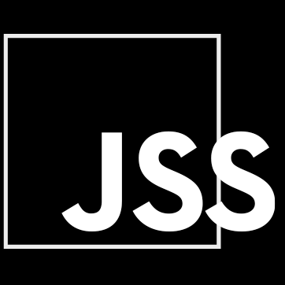

- 👋 Hi! Nice to meet you! [@the.pro.developer] I'm Krystian!
- 🌱 I'm currently studying at Bootcamp GOIT & learning everything I can get my hands on...
- 🔭 My goal is to become FULLSTACK DEVELOPER without any borders!
- 🤔 I'm currently trying to make a day have 36 hours.
- 💬 How to reach me:  (kklimczak@icloud.com)
- 🌱 My knowledge at the moment :

<!-- 
  

- Languages:

- Frameworks/Platforms:

- Tools:

 -->

<!--

  

  

 

 

 

 

  
    
